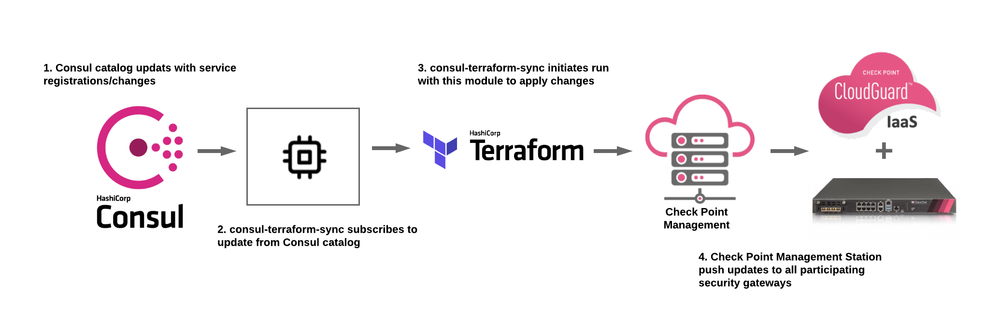
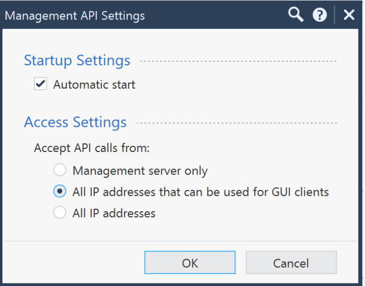
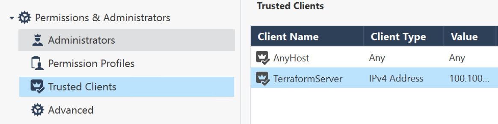
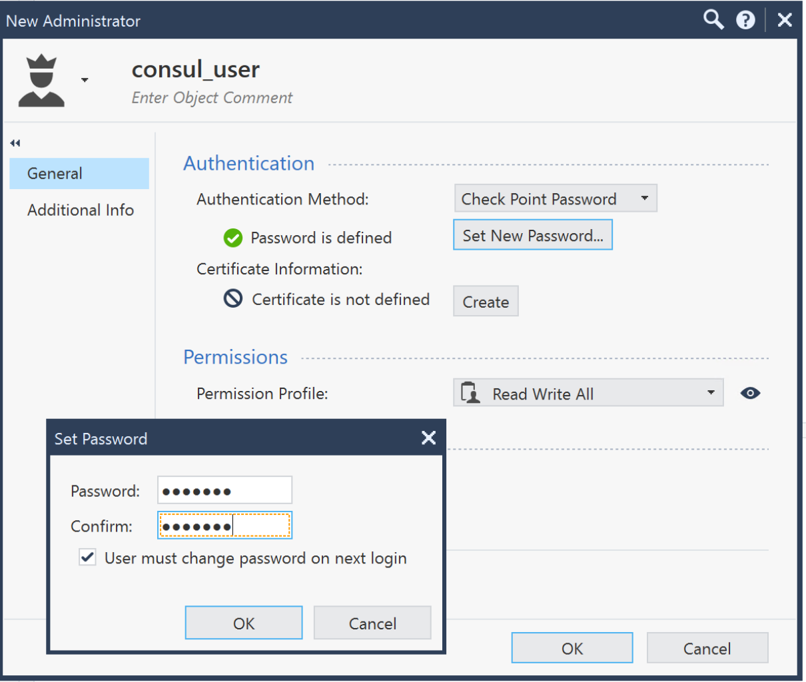
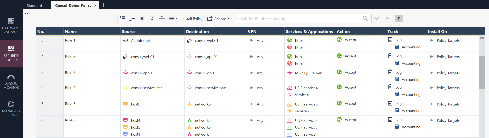

# Check Point Software Technologies Dynamic Objects module for Network Infrastructure Automation (NIA)

This Terraform module allows users to support **Dynamic Firewalling** by integrating [Consul](https://www.consul.io/) with Check Point Software Technologies Cloud and Network-based [**Security Gateway**](https://www.checkpoint.com/solutions/network-security/) devices to dynamically manage registration/de-registration of **Dynamic Objects** based on services in Consul catalog.  

Using this Terraform module in conjunction with **consul-terraform-sync** enables teams to reduce manual ticketing processes and automate Day-2 operations related to application scale up/down in a way that is both declarative and repeatable across the organization and multiple **Check Point Firewalls**. This integration will allow teams to quickly deploy applications while cutting down on security operation overhead which is also prone to human error. With predefined security policies in Check Point Gateways, this can also eliminate the lengthy change management process as service updates do not require a policy install.

#### Note: This Terraform module is designed to be used only with **consul-terraform-sync**

## Feature
This module supports the following:
* Create, update and delete Dynamic Objects based on name and IP address for the service in Consul catalog. If the service address is not defined in Consul catalog, node address is used instead.

If there is a missing feature or a bug please follow this [link](https://github.com/chkp-jguo/checkpoint-nia-module/issues/new) to provide your feedback. 

## What is consul-terraform-sync?

The **consul-terraform-sync** runs as a daemon that enables a **publisher-subscriber** paradigm between **Consul** and **Check Point Firewalls** based devices to support **Network Infrastructure Automation (NIA)**. 

<p align="left">
 </a>
</p>

* consul-terraform-sync **subscribes to updates from the Consul catalog** and executes one or more automation **"tasks"** with the appropriate value of *service variables* based on those updates. **consul-terraform-sync** leverages [Terraform](https://www.terraform.io/) as the underlying automation tool and utilizes the Terraform provider ecosystem to drive relevant change to the network infrastructure. 

* Each task consists of a runbook automation written as a compatible **Terraform module** using resources and data sources for the underlying network infrastructure provider.

Please refer to this [link](https://www.consul.io/docs/nia/installation/install) for getting started with **consul-terraform-sync**

## Requirements

| Name | Version |
|------|---------|
| terraform | >= 0.13 |
| consul-terraform-sync | >= 0.1.0 |
| consul | >= 1.7 |

## Providers

| Name | Version |
|------|---------|
| checkpoint | >= 1.0.5 |

## Compatibility
This module is meant for use with **consul-terraform-sync >= 0.1.0** and **Terraform >= 0.13** and **Check Point >= R80.x**

## Usage
In order to use this module, you will need to install **consul-terraform-sync**, create a **"task"** with this Terraform module as a source within the task, and run **consul-terraform-sync**.

The users can subscribe to the services in the consul catalog and define the Terraform module which will be executed when there are any updates to the subscribed services using a **"task"**.

**~> Note:** It is recommended to have the [consul-terraform-sync config guide](https://www.consul.io/docs/nia/installation/configuration) for reference.  
1. Download the **consul-terraform-sync** on a node which is highly available (preferably, a node running a consul client)
2. Add **consul-terraform-sync** to the PATH on that node
3. Check the installation
  ```
  $ consul-terraform-sync --version
  0.1.0
  Compatible with Terraform ~>0.13.0
  ```
4. Create a config file **"tasks.hcl"** for consul-terraform-sync. Please note that this just an example. 

```
terraform
log_level = "info"

consul {
    address = "192.168.0.1:8500"
}

buffer_period {
    min = "5s"
    max = "20s"
}

driver "terraform" {
  log = true
  required_providers {
    checkpoint = {
      source = "CheckPointSW/checkpoint"
    }
  }
}

provider "checkpoint" {
  server = "192.168.0.5"
  username = "consul_user"
  password = "test123"
  context = "web_api"
  timeout = 60
}

<!-- task {
    name = "sample"
    description = "This task dynamically updates service addresses"
    source = "../../"
    providers = ["checkpoint"]
    services = ["web_services", "api_services", "db_services"]
} -->

task {
  name = <name of the task (has to be unique)> # eg. "Create_DynamicObjects_on_CheckPointFW"
  description = <description of the task> # eg. "Check Point Dynamic Objects based on service definition"
  source = "sample_dir/checkpoint"
  providers = ["checkpoint"]
  services = ["<list of consul services you want to subscribe to>"] # eg. ["web", "api"]
  variable_files = ["<list of files that have user variables for this module (please input full path)>"] # eg. ["/sample_dir/checkpoint/sample.tfvars"]
}
```

 5. Start consul-terraform-sync
```
$ consul-terraform-sync -config-file=sample.hcl
```
**consul-terraform-sync** will create Dynamic Objects on Check Point devices based on the values in consul catalog.

**consul-terraform-sync is now subscribed to the Consul catalog. Any updates to the services identified in the task will result in updating the address and Dynamic Objects on the Check Point devices** 


## Installation Steps

### 1. Create API user for Consul and Enable API access

1. From Check Point SmartConsole, navigate to Manage & Settings > Blades > Management API > Advanced Settings. 

<p align="left">
 </a>
</p>

  Note: For production deployments, make sure the **consul-terraform-sync** server is configured as a GUI client. For information on GUI Clients, please refer [here.](https://sc1.checkpoint.com/documents/R80.40/WebAdminGuides/EN/CP_R80.40_Gaia_AdminGuide/Content/Topics-GAG/GUI-Clients.htm)

2. From Check Point SmartConsole, navigate to Manage & Settings > Permissions & Administrators > Trusted Clients > Right Click > New. 

<p align="left">
 </a>
</p>

3. Create API user, From Check Point SmartConsole > navigate to Manage & Settings > Permissions & Administrators > New User > Set username > Set password > Set Permission Profile - Read Write All 

  Note: For granular control of user profiles, please refer [here.](https://sc1.checkpoint.com/documents/R80.40/WebAdminGuides/EN/CP_R80.40_SecurityManagement_AdminGuide/Content/Topics-SECMG/Assigning-Permission-Profiles-to-Administrators.htm?TocPath=Managing%20User%20and%20Administrator%20Accounts%7CManaging%20Administrator%20Accounts%7C_____7)

<p align="left">
 </a>
</p>

4. Install Database, From Check Point SmartConsole > drop-down menu from top left > Install Database


### 2. Setup Check Point Security Management Server (SMS)

1. Transfer the following files to SMS consul directory (/usr/local/consul)

Files: consul-mgmt.sh and consul-gw.sh

Create the consul directory on SMS
```
mkdir -p /usr/local/consul/log /usr/local/consul/tmp
```

Update consul-mgmt.sh with credentials from previous step
```
#!/bin/bash
# v1 - HashiCorp Consul Integration
# This script is for Check Point Mgmt Station

# Check Point Mgmt Station credentials
vUSERNAME="consul_user"
vPASSWORD="test123"
```

2. Run the consul-mgmt.sh to generate all the required files and setup cron

```
chmod 755 consul-mgmt.sh consul-gw.sh
sh consul-mgmt.sh
clish -s -c "add user consul_user uid 0 homedir /home/consul_user"
{ crontab -l -u consul_user; echo '*/2 * * * * /usr/local/consul/consul-mgmt.sh'; } | crontab -u consul_user -
crontab -u consul_user -l
```

3. Modify the **gateways** file to include all participating gateways

Example
```
192.168.0.1
192.168.0.2
```

  Note: consul-mgmt.sh will initialize each gateway with all required files

Initialized gateway example
```
192.168.0.1,init
192.168.0.2,init
```

4. Configure and install security policy with Consul services

<p align="left">
 </a>
</p>


### 3. Configure consul-terraform-sync

1. Donwload and transfer the following files to the server where you will be running consul-terraform-sync. Please refer to this [link](https://releases.hashicorp.com/consul-terraform-sync/) to download latest version of consul-terraform-sync. 
  
Files: consul-terraform-sync (binary), main.tf, variables.tf, publish.sh, publish_linux or publish_osx

2. Modify sample.hcl 

**Consul Server**
```
consul {
    address = "192.168.0.1:8500"
}
```

**Tasks** - Update Consul services you want to monitor
```
task {
    name = "sample"
    description = "This task dynamically updates service addresses"
    source = <Module Path>
    providers = ["checkpoint"]
    services = ["web_services", "api_services", "db_services"]
}
```

  Note: If you did not specify a -config-dir then you can use **source = "../../"**

**Provider** - Use Check Point credentials from previous steps
```
provider "checkpoint" {
  server = "192.168.0.5"
  username = "consul_user"
  password = "test123"
  context = "web_api"
  timeout = 60
}
```

  Note: You can also use **api-key** by replacing username/password

3. Update publish.sh

Use Check Point credentials from previous steps

```
#!/bin/bash
export CHECKPOINT_SERVER="192.168.0.5"
export CHECKPOINT_USERNAME="consul_user"  
export CHECKPOINT_PASSWORD="test123"
export CHECKPOINT_CONTEXT="web_api"
export CHECKPOINT_TIMEOUT=60
sleep 2
if [[ "$OSTYPE" == "linux-gnu"* ]]; then
publish_linux
elif [[ "$OSTYPE" == "darwin"* ]]; then
publish_osx
fi
```

  Note: The **Publish** binary is for Linux 64bit and OSX. For all other platforms, please follow [this link](https://registry.terraform.io/providers/CheckPointSW/checkpoint/latest/docs#publish) to complile the required platform. 

4. Start the consul-terraform-sync

```
chmod 755 consul-terraform-sync
./consul-terraform-sync --config-file sample.hcl
```


### 4. Troubleshooting

1. Verify Consul services by running dynamic_objects command from each security gateway

command: dynamic_objects -l
```
[Expert@r8040gw:0]# dynamic_objects -l
object name : consul-api
range 0 : 172.31.13.27           172.31.13.27
range 1 : 172.31.29.206          172.31.29.206
range 2 : 172.31.94.1            172.31.94.1

object name : consul-redis
range 0 : 10.23.239.10           10.23.239.12

object name : consul-ssh
range 0 : 172.31.94.1            172.31.94.1

object name : consul-web
range 0 : 172.31.43.78           172.31.43.78
range 1 : 172.31.51.85           172.31.51.85
range 2 : 192.168.128.17         192.168.128.17
```

2. Log directory on SMS and Security Gateway

- /usr/local/consul/logs
